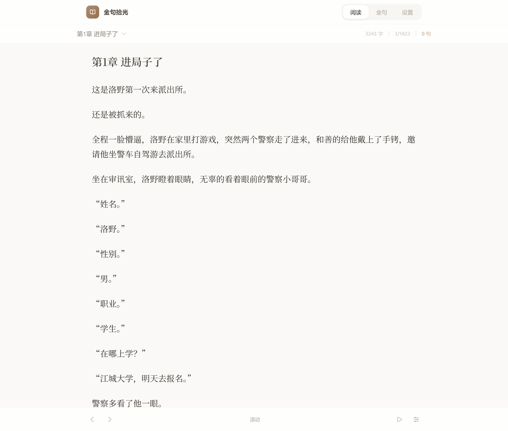

# 金句拾光

一款专注于 EPUB 电子书阅读与金句摘录的轻量级 Web 应用。


## 功能特性

- **📖 EPUB 阅读** - 支持导入 EPUB 格式电子书，自动解析章节结构
- **✨ 金句摘录** - 阅读时右键或长按段落即可收藏金句，支持多选合并
- **🏷️ 标签管理** - 为书籍添加标签，便于分类整理
- **🔍 快速跳转** - 从金句列表一键跳转到原文位置
- **📱 双阅读模式** - 支持滚动模式和翻页模式，满足不同阅读习惯
- **▶️ 自动阅读** - 支持自动滚屏/翻页，解放双手
- **💾 本地存储** - 所有数据保存在浏览器 IndexedDB，保护隐私
- **📤 数据导出** - 支持导出/导入完整数据（书籍、金句、进度、设置）



## 技术栈

- **React 19** - UI 框架
- **TypeScript** - 类型安全
- **Tailwind CSS 4** - 样式系统
- **Vite** - 构建工具
- **IndexedDB** - 本地数据存储
- **JSZip** - EPUB 文件解析

## 快速开始

```bash
# 安装依赖
npm install

# 开发模式
npm run dev

# 构建生产版本
npm run build

# 预览生产构建
npm run preview
```

## 使用说明

1. **导入书籍**：拖拽或点击选择 EPUB 文件，添加标签后点击"开始阅读"
2. **摘录金句**：
   - 桌面端：右键点击段落，选择"设为本句"
   - 移动端：长按段落唤起菜单
   - 多选模式：可连续选择多个段落合并为一条金句
3. **管理金句**：在"金句"标签页查看、编辑、复制或删除收藏的内容
4. **阅读设置**：在"设置"中调整字体大小、行高、阅读模式等
5. **数据备份**：通过"导出数据"功能备份到本地文件，可随时"导入数据"恢复

## 项目结构

```
src/
├── App.tsx           # 主应用组件
├── db.ts             # IndexedDB 数据层
├── types.ts          # TypeScript 类型定义
├── utils.ts          # 工具函数（EPUB 解析等）
├── components/
│   ├── UploadPage.tsx    # 书籍上传页
│   ├── Reader.tsx        # 阅读器组件
│   ├── QuoteList.tsx     # 金句列表
│   └── SettingsPage.tsx  # 设置页面
└── utils/
    └── cn.ts         # 类名合并工具
```

## 隐私说明

- 所有数据仅存储在本地浏览器中，不会上传到任何服务器
- 支持通过导出功能将数据备份到本地文件
- 清除浏览器数据将导致应用数据丢失，请定期备份
